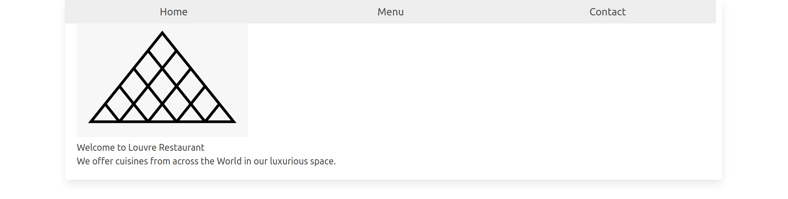

# Restaurant Page

> Building a bare-bones restaurant page using Javascript modules and webpack.

## Built With

- HTML, CSS, Javascript
- Webpack

## Live Demo

[Live Demo Link]()

## Getting Started

**Run npm init to load all node modules used**
**Run the index.html file in the dist folder**

## Authors

👤 **Adebola**

- Github: [@githubhandle](https://github.com/onedebos)
- Twitter: [@twitterhandle](https://twitter.com/debosthefirst)
- Linkedin: [linkedin](https://www.linkedin.com/in/adebola-niran/)

## Show your support

Give a ⭐️ if you like this project!

## 📝 License

This project is [MIT](lic.url) licensed.
